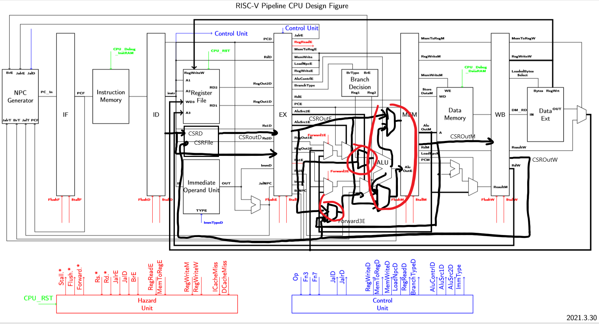

# 计算机体系结构 Lab2

PB18111787 林焕承

## 实验目标

实现RV32I流水线CPU。

实现以下指令：

SLLI、SRLI、SRAI、ADD、SUB、SLL、SLT、SLTU、XOR、SRL、SRA、OR、AND、ADDI、SLTI、SLTIU、XORI、ORI、ANDI、LUI、AUIPC、JALR、LB、LH、LW、LBU、LHU、SB、SH、SW、BEQ、BNE、BLT、BLTU、BGE、BGEU、JAL、CSRRW、CSRRS、CSRRC、CSRRWI、CSRRSI、CSRRCI

处理数据相关，以及添加CSR数据通路

## 实验环境和工具

**操作系统：**Windows 10

**实验工具：**Vivado 2019.2

## 实验内容和过程

### 阶段一

为了实现指令 SLLI、SRLI、SRAI、ADD、SUB、SLL、SLT、SLTU、XOR、SRL、SRA、OR、AND、ADDI、SLTI、SLTIU、XORI、ORI、ANDI、LUI、AUIPC

需要完成以下部件

- ControlUnit 完成对各个指令后续处理
- ALU 完成几种运算，要注意有符号数和无符号数
- DataExt 实现数据对齐
- ImmOperandUnit 完成对不同类型立即数构建
- 段寄存器补充

对于以下测试样例

```assembly
.org 0x0
 	.global _start
_start:
    lui x1, 0x1
    nop
    nop
    nop
    nop
    lui x2, 0x2
    nop
    nop
    nop
    nop
    add x3,x1,x2
    nop
    nop
    nop
    nop
    addi x3,x2,0x3
    nop
    nop
    nop
    nop
    sub x4,x2,x3
    nop
    nop
    nop
    nop
    lui x1, 0x1
    nop
    nop
    nop
    nop
    lui x2, 0x2
    nop
    nop
    nop
    nop
    srli x2,x2,0xc
    nop
    nop
    nop
    nop
    sll x3,x1,x2
    nop
    nop
    nop
    nop
    slli x3,x1,0x2
    nop
    nop
    nop
    nop
    lui x1,0x4
    nop
    nop
    nop
    nop
    srl x3,x1,x2
    nop
    nop
    nop
    nop
    srli x3,x1,0x2
    nop
    nop
    nop
    nop
    lui x1,2
    nop
    nop
    nop
    nop
    sub x1,x0,x1
    nop
    nop
    nop
    nop
    lui x2,0x1
    nop
    nop
    nop
    nop
    srli x2,x2,0xc
    nop
    nop
    nop
    nop
    sra x3,x1,x2
    nop
    nop
    nop
    nop
    srai x3,x1,0x1
    nop
    nop
    nop
    nop
    slt x3,x1,x2
    nop
    nop
    nop
    nop
    slti x3,x1,0x1
    nop
    nop
    nop
    nop
    sltu x3,x1,x2
    nop
    nop
    nop
    nop
    sltiu x3,x1,0x1
    nop
    nop
    nop
    nop
    xor x3,x1,x2
    nop
    nop
    nop
    nop
    xori x3,x1,0x1
    nop
    nop
    nop
    nop
    or x3,x1,x2
    nop
    nop
    nop
    nop
    ori x3,x1,0x1
    nop
    nop
    nop
    nop
    and x3,x1,x2
    nop
    nop
    nop
    nop
    andi x3,x1,0x1
    nop
    nop
    nop
    nop
    auipc x3,0x1
    nop
    nop
    nop
    nop
```

可以得到以下波形，说明功能完好。


### 阶段二

实现以下指令 

JALR、LB、LH、LW、LBU、LHU、SB、SH、SW、BEQ、BNE、BLT、BLTU、BGE、BGEU、JAL

同时需要处理数据相关。

要修改以下部件

- ControlUnit 添加产生以上新指令的控制信号
- HazardUnit 
  - Forward 需要处理从 WB 段的 Forward 和 Mem 段的 Forward
  - 对于 EXE 段产生的 Hazard 需要进行 STALL
- NPC_GENERATOR 需要加入两种跳转信号
- WBSegReg 需要对齐非对其指令存储

对于给定的三个测试样例波形如下


寄存器在运行完样例后是 1，说明功能完好。

### 阶段三

实现 CSRRW、CSRRS、CSRRC、CSRRWI、CSRRSI、CSRRCI 指令。

设计图如下



需要增加以下部件

CSRFile CSR寄存器堆

```verilog
module CSRFile(
    input wire clk,
    input wire rst,
    input wire WE3,
    input wire [11:0] A1,
    input wire [11:0] A3,
    input wire [31:0] WD3,
    output wire [31:0] RD1
    );

    reg [31:0] RegFile[4095:0];
    integer i;
    //
    always@(negedge clk or posedge rst) 
    begin 
        if(rst)                                 for(i=0;i<4096;i=i+1) RegFile[i][31:0]<=32'b0;
        else if(WE3==1)    RegFile[A3]<=WD3;   
    end
    //    
    assign RD1= RegFile[A1];
    
endmodule
```

需要修改以下部件

**RV32Core**

添加了新的控制信号，以及连线和设计选择器。

设计两个选择器用于交换 ALUout 的数据和 CSRout 数据，将 CSRout 数据写到寄存器堆，将 ALUout 数据写到 CSR。

**ControlUnit**

添加了对新增加指令的支持。

**ALU**

添加了对 CSR 指令需要的两种运算：取第一个 Operand 及取反求与。

**HazardUnit**

添加了对 CSR 寄存器的 Forward，与 RegFile 的 Forward 原理一样

**ImmOperandUnit**

添加了支持 CSR 立即数指令的立即数提取。

**各个段寄存器**

添加对新增控制信号的向后传递。

以下是测试代码

```assembly
.org 0x0
 	.global _start
    #CSRRW rd, csr, rs1
_start:
    lui x2,0x1
    lui x1,0x1
    csrrw x2,0x000,x1
    lui x1,0x3
    csrrs x2,0x000,x1
    csrrc x2,0x000,x1
    csrrwi x2,0x000,1
    csrrsi x2,0x000,3
    csrrci x2,0x000,3
    csrrsi x2,0x000,0
```

仿真结果二号寄存器和 0 号 CSR 寄存器状态如下


说明功能完好。

## 实验总结

### 一些踩坑


- SLL, SRA, SRL 移位时没有取低位。
- 没有做非对齐存储。
- 在网上找到了假文档说 CSRRC 指令的运算只是与运算。

### 收获

熟悉了 RV32 流水线 CPU，学到了 CSR 是什么。

### 时间

阶段二花了最多时间约 8 小时，不停修改各个模块的 bug。

阶段一、三都花了 4 小时左右，比较顺利。

